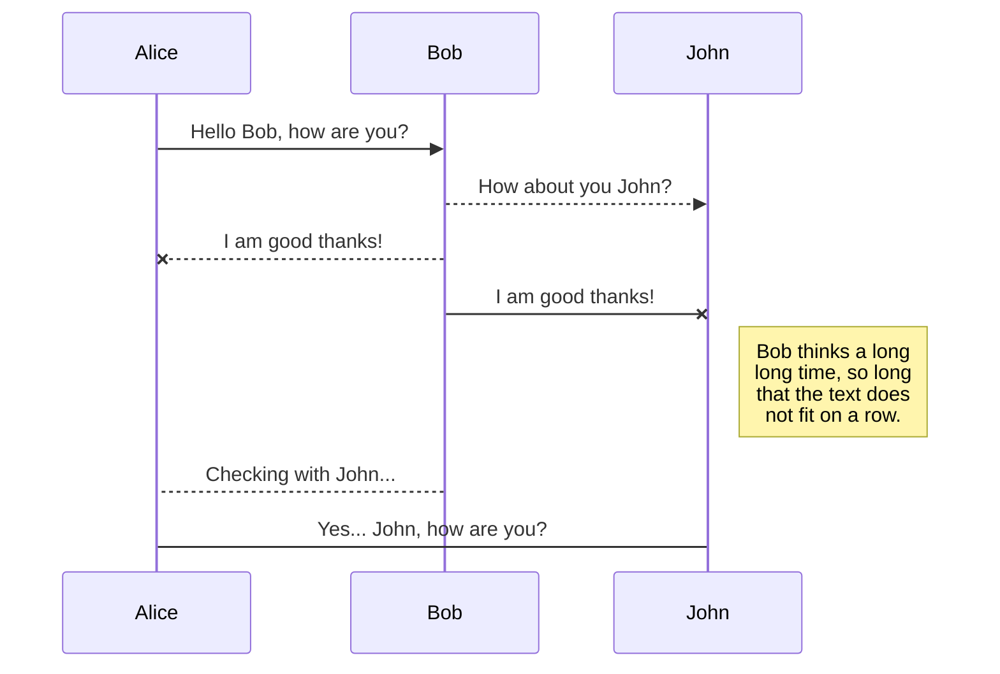
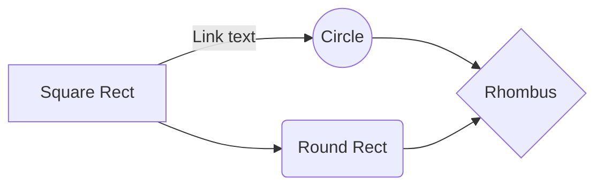

# PHP Klassen und Objekte

PHP kann sowohl prozedual wie auch objektorientiert verwendet werden. *Dies ist nicht eine Einführung in die Objekt-orientierte Programmierung.*

## Klasse

Eine Klasse entspricht einer *Schablone*, mit welcher Objekte erstellt werden können. Die Klasse definiert sich über Attribute und Methoden.

```mermaid
classDiagram
Hero
```



And this will produce a flow chart:



```php
class Hero {

	// Attribute
	public $name = '';
	public $realname = '';
	private $popularity = 0;

	// Konstante
	const POPULARITY_MAX = 5;	

	// Konstruktor
	function __construct ($name, $realname, $popularity) {
		$this->name = $name;
		$this->realname = $realname;
		$this->setPopularity($popularity);
	}

	// Methoden
	public function setPopularity ($popularity) {
		if (self::validatePopularity($popularity)) {
			$this->popularity = $popularity;
		}
	}

	public function getPopularity () {
		return $this->popularity;
	}

        static function validatePopularity ($popularity) {
		return ($popularity > 0 && $popularity <= self::POPULARITY_MAX);
	}
}
```
Damit auf ein Attribut oder eine Methode aufgerufen werden kann, muss erst eine Instanz (Objekt) der Klasse erstellt werden. Eine Ausnahme sind statische Methoden oder Konstanten, diese lassen sich auch direkt aufrufen.

private/public
: Zugriff auf Attribute und Methoden nur innerhalb des Objekts (*private*) oder auch von aussen (*public*) erlauben

static
: Definition einer statischen Methode. In statischen Methoden ist es nicht möglich, auf `$this` zuzugreifen.

const
: Definition einer Konstanten, Aufruf über `self::PRIORITY_MAX`

__construct()
: Die Methode `__construct()` wird bei der Erstellung eines Objektes aufgerufen. Die aufgeführten Argumente müssen beim Erstellen des Objektes berücksichtigt werden.

$this
: Attribute und Methoden werden innerhalb der Klasse über `$this->` aufgerufen.

```php
// Objekt erstellen
$task = new Hero('Spiderman', 'Peter Parker', 5);

// Methode aufrufen
$popularity = $task->getPopularity();

// Statisch Methode aufrufen
$isValid = Hero::validatePopularity($popularity);
``` 

->
: Der Zugriff auf Attribute und Methoden eines Objektes erfolgt über den Operator `->`

::
: Der Zugriff auf statische Methoden erfolgt über `::`


<!--stackedit_data:
eyJoaXN0b3J5IjpbLTEyODk0NjQ4MCw5MzMyNDA5NDEsMjAwMz
QzODI2NywtODg4NjY5Mjg1LC0xMzEyNjQ2NDAsLTcxNDg1Mzg3
OSwtMTQxNDQxNzA3Ml19
-->